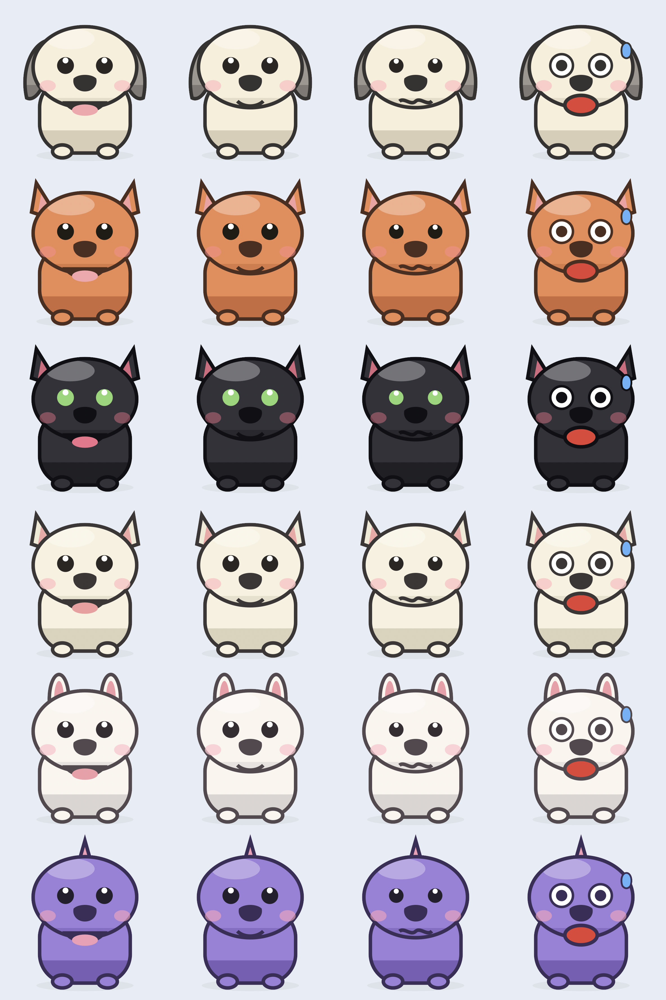

# Usage Pet 🐾 — 桌面用量宠物

[English](#english) · [中文](#中文)

一只悬浮在 macOS 桌面的像素宠物，实时显示你的 AI 用量额度（5 小时 / 周限额）。
用量越紧张，宠物越焦虑——再也不用一遍遍敲 `/cost` 或翻设置页。

A floating pixel pet for macOS that shows your AI usage limits at a glance.
The more quota you burn, the more anxious the pet gets.



支持的数据源 / Supported providers：

- **Claude**（Claude Code / claude.ai 订阅额度）
- **Codex**（OpenAI Codex CLI 速率限额）
- **中转 API / Relay**（one-api、new-api 等网关的 $ 余额，可加多个）

**同一时刻只显示一个**数据源——右键 → 数据源 里单选 Claude / Codex / 某个中转，
气泡和宠物心情都只反映选中的那一个，清爽不打扰。

---

## 中文

### 功能
- 桌面悬浮像素宠物，按用量切换表情：吐舌开心(0-50%) → 平静(50-80%) → 担心(80-95%) → 瞪眼冒汗(95%+)
- **6 种形象**可换：🐶 奶白小狗 / 🐱 橘猫 / 🐈‍⬛ 黑猫 / 🐱 奶白猫 / 🐰 小兔 / 👾 小怪兽
- **鼠标悬停**：弹气泡显示各项用量百分比 + 重置倒计时
- **显示当前模型**：气泡标出正在用的模型（如 Opus 4.8），从本地会话日志读取
- **拖动**移动 · **右键**菜单 · **开机自启**
- 默认每 5 分钟自动刷新

### 数据源怎么配

**Claude** — 内嵌一个真实浏览器，第一次会弹窗让你登录 claude.ai（登录一次，cookie 持久保存）。
之后静默调用 `claude.ai/api/organizations/{org}/usage` 取数；org id 从 `lastActiveOrg`
cookie 读取，并让 WebKit 自动通过 Cloudflare 校验。

**Codex** — 需要安装官方 [OpenAI Codex CLI](https://openai.com/codex) 并 `codex login`。
本应用通过 `codex app-server` 的 JSON-RPC 接口 `account/rateLimits/read` 读取限额，
不爬网页。若 codex 装在非标准路径，可设环境变量 `CLAUDEPET_CODEX_BIN=/path/to/codex`。

> 默认选中 Claude。右键 → 数据源 单选切换到 Codex 或某个中转。

**中转 API / Relay** — 给走第三方网关或按量计费 API 的用户。右键 →
数据源 → 添加中转 API…，填名称、Base URL、API Key（添加后自动切到它）。
应用会**自动探测**多种主流余额接口，第一个命中的即采用：

| 类型 | 接口 | 显示 |
|------|------|------|
| one-api / new-api 等 | `/v1/dashboard/billing/subscription` + `/usage` | 余额 = 总额度 − 已用 + 用量% |
| DeepSeek | `/user/balance` | 余额（¥）|
| OpenRouter | `/api/v1/credits` | 余额 = total − used + 用量% |
| 硅基流动 SiliconFlow | `/v1/user/info` | 余额（¥）|

> Base URL 填带不带 `/v1`、`/anthropic` 都行，应用会自动处理路径。
> 可添加多个，配置存于 `~/.claude/claude-pet-relays.json`(权限 600)。
> 其它格式的中转欢迎在 `Sources/Relay.swift` 的探测链里加一条 PR。

### 构建运行
```bash
./build.sh          # 编译生成 ClaudePet.app
open ClaudePet.app
```
依赖：macOS 12+、Xcode 命令行工具（`swiftc`）。无第三方库。

### 右键菜单
立即刷新 · 换形象 · 数据源(Claude/Codex 开关) · 登录 Claude · 开机自启动 · 退出

### 数据与隐私
所有数据只在本地使用，不上传任何服务器。
- Claude 登录态：WebKit 持久 cookie（`~/Library/WebKit/...`）
- 形象/开关偏好：`UserDefaults`
- 调试日志：把 `Sources/Usage.swift` 的 `logging` 改成 `true`，写到 `~/.claude/claude-pet.log`

---

## English

### Features
- Floating pixel pet; expression tracks usage: happy (0-50%) → calm (50-80%) → worried (80-95%) → panicking (95%+)
- **6 skins**: dog / cat / black cat / cream cat / rabbit / monster
- **Hover** for a bubble with per-window percentages and reset countdowns
- Shows the **current model** in use (read from local session logs)
- **Drag** to move · **right-click** menu · **launch at login**
- Auto-refreshes every 5 minutes

### Configuring providers

**Claude** — uses an embedded WebView. On first use it pops a window to log into
claude.ai (one-time; cookies persist). It then silently calls
`claude.ai/api/organizations/{org}/usage`, reading the org id from the
`lastActiveOrg` cookie and letting WebKit clear Cloudflare automatically.

**Codex** — requires the official [OpenAI Codex CLI](https://openai.com/codex)
(`codex login`). Usage is read via the `codex app-server` JSON-RPC method
`account/rateLimits/read` — no scraping. For a non-standard path, set
`CLAUDEPET_CODEX_BIN=/path/to/codex`.

> Only **one** source is shown at a time. Pick it via right-click → 数据源 (Sources):
> Claude / Codex / a relay. Bubble and pet mood reflect just that one.

### Build & run
```bash
./build.sh
open ClaudePet.app
```
Requires macOS 12+ and Xcode command-line tools (`swiftc`). No third-party deps.

### Privacy
Everything stays local; nothing is uploaded. Claude session lives in WebKit's
persistent cookie store; preferences in `UserDefaults`.

---

## 加新的数据源 / Adding a provider

数据源是解耦的——参考 `Sources/Codex.swift`：实现一个返回 `(5h%, weekly%, resets)`
的 fetcher，然后在 `AppDelegate.refresh()` 和 `bubbleText()` 里接上即可。

> **为什么只内置 Claude 和 Codex？** 这两家有能直接拿到「订阅限额%」的来源
> （claude.ai usage 接口 / `codex app-server` RPC）。Gemini、Qwen、Kimi 等没有这类
> 接口，目前只能把 CLI 跑在伪终端里抓屏解析 TUI，较脆弱，故未内置。欢迎按需 PR。

Providers are decoupled. To add one, mirror `Sources/Codex.swift` (return
5h/weekly percentages + reset dates) and wire it into `AppDelegate.refresh()`
and `bubbleText()`. PRs for other AIs welcome.

## 代码结构 / Layout
| 文件 | 作用 |
|------|------|
| `Sources/Pixel.swift` | 像素网格渲染 |
| `Sources/Pet.swift`   | 6 种形象 + 4 心情帧 |
| `Sources/Usage.swift` | Claude 数据模型 |
| `Sources/Web.swift`   | Claude WebKit 数据源(登录+取数) |
| `Sources/Codex.swift` | Codex `app-server` RPC 数据源 |
| `Sources/Relay.swift` | 中转 API 余额数据源(OpenAI 兼容计费接口) |
| `Sources/ModelInfo.swift` | 从本地会话日志读当前模型 |
| `Sources/App.swift`   | 悬浮窗 / 气泡 / 交互 / 菜单 |
| `Sources/main.swift`  | 入口 |

## License
MIT © 2026 awen
